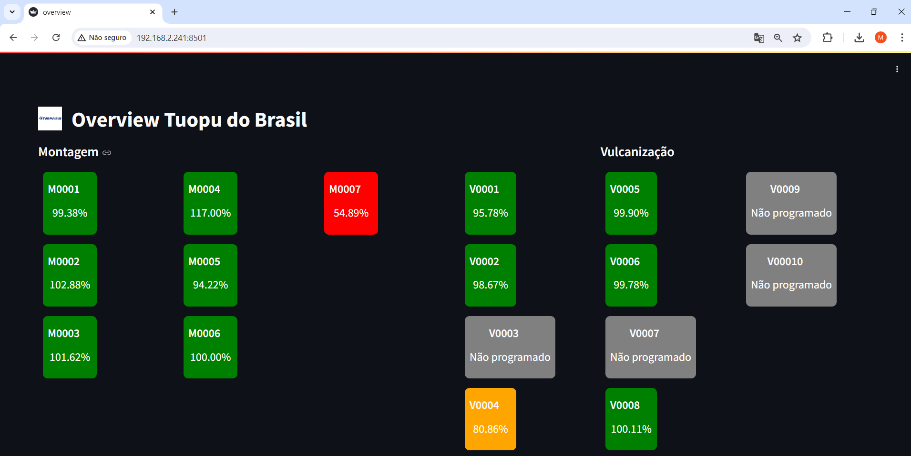
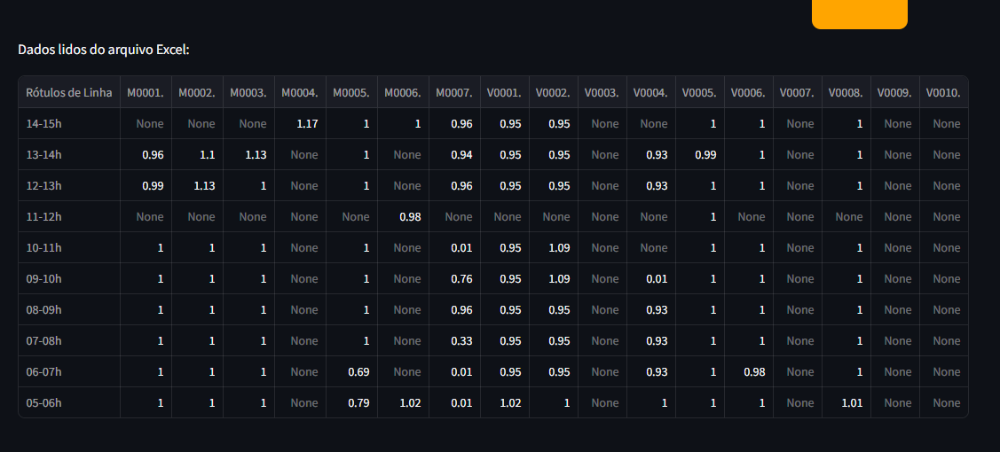

# Overview Tuopu do Brasil




Este projeto é uma aplicação de dashboard desenvolvida com Streamlit para visualização de indicadores de produção da Tuopu do Brasil.

## Visão Geral

Na fábrica da Tuopu do Brasil, utilizamos várias planilhas automatizadas com VBA para realizar os lançamentos de produção. Esses dados são essenciais para monitorar a eficiência e a produtividade da linha de montagem e vulcanização. No entanto, a análise manual desses dados pode ser demorada e suscetível a erros.

Para resolver esse problema, desenvolvemos uma dashboard interativa utilizando Python, Streamlit e Pandas. Esta dashboard compila automaticamente os dados das planilhas e apresenta uma visão em tempo real dos indicadores de produção. Isso permite que a equipe de gestão acompanhe rapidamente o desempenho da fábrica e tome decisões informadas.

## Funcionalidades

- **Visualização de Indicadores**: A dashboard exibe indicadores de produção para as linhas de Montagem e Vulcanização.
- **Atualização Automática**: Os dados são atualizados automaticamente a partir de um arquivo Excel que é atualizado diariamente.
- **Cores Indicativas**: Os indicadores são apresentados com cores que facilitam a identificação do desempenho (verde, laranja e vermelho).
- **Tooltips**: Informações adicionais são exibidas ao passar o mouse sobre os indicadores.
- **Acesso Facilitado:** A dashboard pode ser acessada de qualquer computador dentro da empresa através de um link com o número de IP informado.
- **Exportação de Dados:** A tabela com todos os dados de lançamento do dia pode ser exportada em formato CSV para análises adicionais.

## Instalação

1. Clone o repositório:
   ```bash
   git clone https://github.com/Mateush01silva/Overview.git

2. Navegue até o repositório do projeto:
    ```bash
    cd seu-repositorio

3. Instale as dependências:
    ```bash
    pip install -r requirements.txt

4. Uso:
    ```bash
    streamlit run overview.py

## Observação

A aplicação só funcionará dentro da empresa em que foi criada, pois possui dependência de alguns arquivos exclusivos da empresa para o seu funcionamento.

